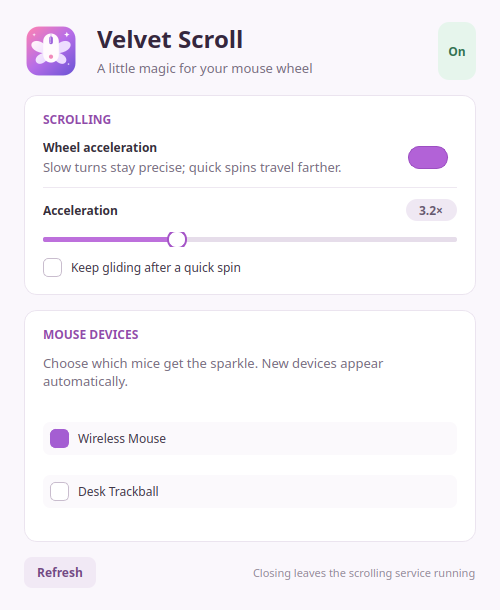

<div align="center">
  
  <h1>Velvet Scroll</h1>
  <p><strong>A little magic for your mouse wheel.</strong></p>
  <p>Precise little scrolls. Faster big flicks. One easy toggle.</p>
</div>

Velvet Scroll is a small Linux mouse-wheel accelerator with a native Qt settings
window, a tray toggle, and a lightweight Rust daemon. Turn the wheel slowly for
fine control; spin it quickly to travel farther. Optional coasting adds a short,
gentle glide after a fast flick.

**Early release.** The input backend works below the desktop through Linux
evdev/uinput, so it is designed for KDE Plasma, GNOME and other desktops on both
Wayland and X11. Desktop and hardware acceptance testing is still needed; this
is not a claim that every distro, mouse or application has been tested.

## What it does

- Keeps slow scrolling at its original distance; acceleration ramps up to a
  configurable **1–8× ceiling**, with a **3×** default.
- Supports vertical and horizontal wheels, high-resolution wheel events and
  conventional detented wheels without counting their companion events twice.
- Offers a tray toggle and `velvet-scroll toggle` for a desktop keyboard shortcut.
- Lets you select each mouse explicitly. **No mice are captured by default.**
- Saves preferences, handles reconnects, and releases input on shutdown or error.
- Keeps the UI out of the input path. You can close the UI and keep scrolling.
- Makes coasting optional and off by default. It cancels on direction changes,
  clicks and meaningful movement from captured devices, disabling, or stalls.

<p align="center"></p>

The pink-and-purple controls are built with PyQt6; the daemon does not need Qt,
Python, X11, Wayland libraries, or a particular service manager.

## Try it

Build with a current stable Rust toolchain, a C compiler, and Cargo. Install
Python 3 and your distro's PyQt6 package for the optional desktop app.

```sh
cargo build --release --locked
./target/release/velvet-scroll demo
```

The demo is a deterministic preview of the acceleration curve; it does not read
or alter any input device.

For actual scrolling, follow the [installation guide](docs/installation.md) to
install the app and grant active-session access to mouse devices and uinput.
Then start the service and open the controls:

```sh
velvet-scroll daemon
# In another terminal:
velvet-scroll gui
```

Select your mouse in the window. Start at the default acceleration and leave
coasting off until the basic feel is right. On desktops with a tray, closing the
window keeps the controls there; on desktops without one, reopen the window when
needed. The CLI works independently of tray support.

For autostart, the package includes a systemd **user** service and a separate XDG
autostart example. Use one method, not both. The installation does not start a
service or select a device automatically.

## Controls

```sh
velvet-scroll status --json
velvet-scroll devices --json
velvet-scroll select 'device-id-from-the-list' on
velvet-scroll set acceleration 3
velvet-scroll set coast on
velvet-scroll toggle
velvet-scroll disable
velvet-scroll stop
```

In Plasma, add a command shortcut for `velvet-scroll toggle` in System Settings →
Keyboard → Shortcuts. Other desktops can bind the same command. There is no
compositor-specific shortcut dependency.

Disabling cancels acceleration and momentum while preserving the virtual device
connection. Stopping the daemon releases the physical devices. Settings live in
`${XDG_CONFIG_HOME:-$HOME/.config}/velvet-scroll/config.json`; prefer the controls
over editing the file while the daemon is running.

## How it works

```text
physical mouse → evdev capture → wheel acceleration → uinput mirror
                                                        ↓
                                           desktop → applications
```

Each selected mouse gets a virtual mirror with the same name and hardware IDs,
so Plasma retains its existing pointer settings. A udev helper copies the source
mouse’s effective DPI and wheel calibration; capture waits for that import. Pointer motion, keys/buttons and other
supported events retain their normal path through the desktop; only wheel values
are transformed. Device preparation happens outside the forwarding loop. IPC is
nonblocking, bounded and restricted to the same user through a private Unix socket.

The engine estimates speed from distance over time rather than counting packets.
An 80 ms decaying history and a smooth capped curve avoid abrupt threshold jumps.
Fractional output is retained. Slow events, reversals, Bluetooth-style batches,
legacy/high-resolution wheel pairing, dropped-event recovery, toggling, and
socket/config behavior have automated tests.

Coasting is deliberately short: after a sustained fast flick, it waits 65 ms,
then adds a decaying tail bounded by 450 ms and two detents. It is a conservative
software glide, not a physical free-spinning wheel.

## Compatibility and limits

- **Initial architectures: x86_64 and ARM64 (aarch64).** Other CPU input ABIs
  are deliberately guarded until validated.
- **Linux evdev and uinput are required.** The supplied permission rules use udev
  and an active-seat ACL manager such as logind. Other setups need equivalent
  device access; systemd itself is not required to run the daemon.
- **Plasma is the first desktop target.** The same backend is intended for GNOME,
  Xfce, Cinnamon and wlroots desktops. GNOME installations without tray support
  can use the settings window and CLI shortcut.
- **Application smoothness varies.** Some applications animate fractional wheel
  input; others scroll by whole lines. Velvet Scroll cannot impose pixel-smooth
  animation on every application.
- **Coasting has no widget or focus information.** It cannot detect a scroll
  boundary or motion/keys from an unselected mouse, touchpad or keyboard. Turn it
  off when this is undesirable. Mouse movement on a captured device cancels it.
- **Existing input remappers can conflict.** Only one exclusive grab can own a
  device. Configure a mouse in one remapper at a time.
- **Pointer settings and calibration are preserved.** Mirrors keep the physical
  mouse’s identity and source DPI metadata. Only wheel values change; original
  event timing is retained for normal pointer acceleration. Avoid stacking a
  large desktop scroll multiplier on top of Velvet Scroll’s gain.
- **Touchpads, tablets and force-feedback controllers are outside its scope.**
  No application-specific profiles or keyboard interception are needed for the
  ordinary mouse path. Composite mice may expose keyboard capabilities on the
  same node; those capabilities must be preserved with the mouse.
- **A standalone Flatpak or AppImage does not solve device permissions.** Use the
  native host install; CI builds Debian, RPM, Arch and tar packages. Build locally
  for your distro's libc, or package on your oldest target.

See [installation and troubleshooting](docs/installation.md) and the
[validation checklist](docs/validation.md).

## Development

```sh
cargo fmt --all -- --check
cargo clippy --all-targets --all-features -- -D warnings
cargo test --all-targets --all-features
QT_QPA_PLATFORM=offscreen python3 -m unittest discover -s ui -p 'test_*.py' -v
make deb                         # Debian-family package tools required
```

Tests use temporary configuration and do not select a physical mouse. Daemon
integration tests require permission to create local Unix sockets. CI also builds
packages for x86_64 and aarch64. See the [release and maintenance guide](docs/releases.md)
for downloads and version policy. No benchmark or desktop compatibility claim
should be inferred from unit tests alone.

Contributions are welcome. Please report your desktop/session type, distro,
mouse model, and `velvet-scroll status --json` output with an issue. Device IDs
can contain serial numbers and physical port paths; redact those before posting.

## License

[MIT](LICENSE) · Copyright © 2026 Zoey Rose.
